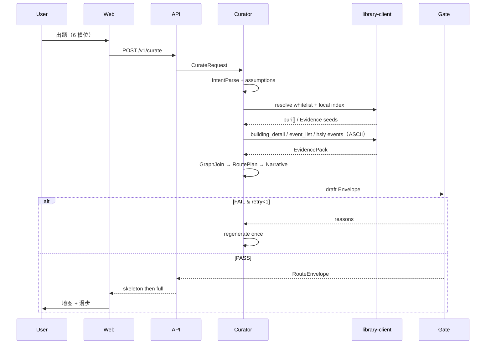

# 02 · 系统架构（完整版）

> 竞赛作品工程架构。商业闭环不在范围内。

---

## 1. 一句话

```
出题 → Curator（取证·缝合·选点·叙事）→ Gate → RouteEnvelope → Web（2.5D / 卡片 / 漫步）
              ↑                                      ↑
     上图 MCP / 本地索引 / 快照              R-20 白名单地理资产
```

**准确性来自数据；好看来自风格化；可演示性来自离线索引。**

---

## 2. 系统全景

```
┌──────────────────────────────────────────────────────────────────────────┐
│ apps/web（Presentation）                                                  │
│  Brief · TripFSM(XState) · Map(R3F|SVG) · Walk · SourceDrawer · Export   │
│  Zustand(UI) · TanStack Query(服务端态) · Zod(契约校验)                    │
└────────────────────────────────┬─────────────────────────────────────────┘
                                 │ HTTP JSON  RouteEnvelope
┌────────────────────────────────▼─────────────────────────────────────────┐
│ apps/api（FastAPI）                                                       │
│  /v1/curate  /v1/curate/stream  /v1/health  /v1/whitelist                │
│  超时 / 重试封顶1 / 观测钩子                                              │
└────────────────────────────────┬─────────────────────────────────────────┘
                                 │
┌────────────────────────────────▼─────────────────────────────────────────┐
│ packages/curator（Python 流水线）                                         │
│  Intent → Evidence → GraphJoin → RoutePlan → Narrative → Gate            │
│  prompts/ ← 总 Prompt v2 落地                                            │
└─────┬───────────────────────────────┬───────────────────┬────────────────┘
      │                               │                   │
┌─────▼──────────────┐  ┌─────────────▼────────┐  ┌──────▼───────────────┐
│ library-client     │  │ content/             │  │ packages/gate        │
│ · SLC HTTP 封装    │  │ · whitelist R-20     │  │ · Q2/Q6/Q7/Q8/R19    │
│ · MCP stdio 可选   │  │ · fixtures 快照      │  │ · redteam runner     │
│ · 本地 SQLite 索引 │  │ · index.sqlite       │  └──────────────────────┘
│ · NO_PROXY / UTF-8 │  └──────────────────────┘
└────────────────────┘
      │
      ▼
┌─────────────────────────────────────────────────────────────────────────┐
│ 外部：上海图书馆开放数据（data1 / data）+ 搜韵（sou-yun，免 Key）          │
│ 参考实现：桌面「上海图书馆开放数据MCP」→ slc_mcp_server.py（12 tools）     │
└─────────────────────────────────────────────────────────────────────────┘
```

---

## 3. 运行模式（三种，可切换）

| 模式 | 何时用 | 数据路径 |
|---|---|---|
| **A. 快照演示** | 答辩 / 无网 / 代理不稳 | 只读 `content/fixtures` + R-20 |
| **B. 本地索引 + 按需上游** | 日常开发默认 | 中文查本地 → `buri` ASCII 打上游 |
| **C. 直连 MCP stdio** | Spike / 调试工具 | API 子进程拉起 `slc_mcp_server.py` |

默认 **B**；答辩优先 **A**（G1 可溯仍成立，表述去掉「实时」）。见 ADR-003 / ADR-004。

---

## 4. 模块边界（硬）

| 模块 | 负责 | 禁止 |
|---|---|---|
| Web | 渲染、交互、本地进度、契约校验 | 取证、编史实、持有 `SLC_API_KEY` |
| API | HTTP、编排调用、时延切分 | 手写叙事 |
| Curator | 六阶段流水线 | 3D 几何 |
| library-client | Key、代理、编码、缓存、MCP/HTTP | 文案润色 |
| content | R-20 / 快照 | 运行时推测开放时间 |
| gate | 阻断与红队 | 放行「看起来合理」的无出处句 |

---

## 5. 主序列



---

## 6. 时延切片（G3）

| 切片 | P95 | 内容 |
|---|---|---|
| skeleton | ≤60s | theme、stops 序、geo、curator_note、transitions |
| full | ≤180s | story_card、scene、导出字段 |
| retry | ≤1 | 否则 degraded + reasons |

门禁不做实时逐条回源探活。

---

## 7. 前端状态所有权（雷达原则）

| 状态 | 所有者 | 库 |
|---|---|---|
| 出题→加载→地图→漫步→收尾 | **TripFSM** | XState |
| 当前点 / 抽屉 / 偏好 | UI Store | Zustand |
| `/curate` 请求缓存与重试展示 | Server State | TanStack Query |
| 地图 camera / 手势 | R3F 局部 | 不进全局 Store |
| RouteEnvelope 形状 | contracts | Zod（前后端同构） |

**禁止**把 R3F 帧状态镜像进 Zustand。

---

## 8. 跨库关系（架构真相）

可编码的 join 主轴：

```
武康路系：building_list → uri(buri) → event_list(buri) → building_detail(uri)
红色旅游：route_getEventList → route_getEventDetail(uri)
纪年：    slc_era(term) / data/{year}.json
诗词：    souyun_poem（免 Key，弱关联）
地理避坑：R-20 白名单（v1 权威）
```

> ⚠️ `building_*` 家族标注为「武康路历史」。v1 地理是「梧桐区 + 一大周边」——  
> **白名单点必须显式映射 `buri`（有则 join，无则仅红事/核录层）**，不得假装全上海建筑库可 join。  
> S0-4 必须报告：白名单内有多少点能打出 `event_list` 非空。

---

## 9. 安全与密钥

- `SLC_API_KEY` **仅**存在于 API/library-client 进程环境变量  
- Web 永不持有 Key  
- 仓库只提交 `.env.example`（占位），不提交 `.env`  
- MCP 发布版同样：Key 由调用方传入，代码零硬编码（与上游 MCP 一致）

---

## 10. 部署（竞赛）

| 组件 | 形态 |
|---|---|
| Web | Vite 静态，可 GitHub Pages / 本地 |
| API + Curator | 本机 uvicorn；演示机同机 |
| 索引 | `content/index.sqlite` 可随演示包 |
| MCP | 可选子进程；生产演示可关掉走快照 |
